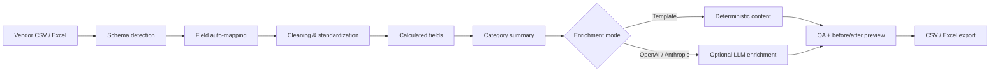

# CatalogFlow AI — Catalog Data Operations Prototype

A local-first Python workflow for cleaning, standardizing, enriching, reviewing, and exporting product-catalog data.

This repository packages a working prototype I built as part of my applied AI / data-operations portfolio. The goal is practical: turn inconsistent vendor files into cleaner, more usable catalog outputs without requiring a heavy data platform.

## What it does

- Ingests CSV, TSV, XLSX, and XLS files
- Processes up to 50,000 rows per run
- Auto-maps common catalog fields such as SKU, title, brand, category, price, cost, stock, description, and URL
- Normalizes whitespace, categories, prices, costs, and stock values
- Creates `stock_status` and `margin_pct` fields
- Produces category-level pivot-style summaries
- Calculates basic data-quality metrics, including missing cells and duplicate rows
- Supports deterministic template enrichment with no API key
- Optionally supports OpenAI or Anthropic enrichment through local environment variables
- Shows before/after previews in a browser UI
- Exports cleaned CSV and a multi-sheet Excel workbook

## Why I built it

Catalog operations often involve repetitive work across inconsistent spreadsheets: renaming fields, cleaning values, checking inventory, preparing descriptions, and producing import-ready files. CatalogFlow explores how a lightweight local workflow can combine **data cleaning + business rules + optional LLM enrichment + human review** in one interface.

## Workflow



## Quick start on Windows

1. Install Python 3.
2. Clone or download this repository.
3. Double-click **`START CATALOGFLOW.bat`**.
4. The app opens on localhost.
5. Upload `sample_data/sample_catalog.csv` to try it without any API key.

You can also install dependencies manually:

```powershell
pip install -r requirements.txt
pyw server.pyw
```

The server binds only to `127.0.0.1` and searches for an available local port beginning at 8771.

## Optional AI enrichment

Template mode works without credentials.

For provider-backed enrichment, copy `.env.example` to `.env` and add your own key locally:

```text
OPENAI_API_KEY=...
ANTHROPIC_API_KEY=...
```

Never commit `.env`.

The prototype limits live provider enrichment to the first 50 rows per run to control cost and latency; template mode can enrich the full dataset.

## Example data-quality logic

The current quality score combines:

- **55% completeness** — proportion of non-missing cells
- **25% uniqueness** — penalty for duplicate rows
- **20% mapping coverage** — how many expected catalog fields were detected

This is a prototype heuristic, not an industry-standard DQ score.

## Repository structure

```text
.
├── app/index.html              # Browser UI
├── sample_data/                # Safe fictional demo data
├── tests/                      # Core normalization / mapping tests
├── server.pyw                  # Local Python backend
├── START CATALOGFLOW.bat       # One-click Windows launcher
├── requirements.txt
├── .env.example
└── .github/workflows/test.yml
```

## Limitations

- Local prototype, not a multi-user production service
- Provider API behavior depends on the model and credentials configured by the user
- No persistent database or user accounts
- Quality scoring is intentionally simple
- Excel support depends on pandas/openpyxl
- Automated enrichment should always be reviewed before publishing product claims

## Development approach

I led the product framing, workflow design, feature selection, testing, and iteration. AI coding assistants were used during implementation. This repository is presented as an **AI-assisted software project**, not as hand-written-from-scratch engineering work.

## Portfolio relevance

This project demonstrates practical work across:

**data operations · process automation · Python · e-commerce operations · business rules · APIs · LLM-assisted workflows · QA / human review**

---

**Author:** Shahzad Raza — IBA Karachi  
**Status:** Working local prototype / portfolio project
